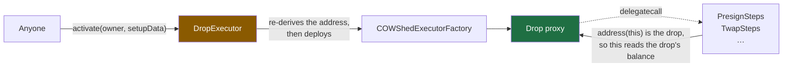

# Contract architecture

`DropExecutor`, five step contracts, four shared pieces. `DropExecutor` carries the security argument;
the split of the rest is an address-stability argument. For the overall design see
[docs/DESIGN.md](../docs/DESIGN.md); for addresses see [docs/DEPLOYMENTS.md](../docs/DEPLOYMENTS.md).

## Layout

The categories are about **addresses**, because a contract's address ends up committed into every drop
that reaches it:

```
src/DropExecutor.sol   has an address, and is not a step: every drop names it as both
                       trustedExecutor and setupTarget
src/steps/             each has an address, named by a recipe as a step's target
src/lib/               no address of its own: inlined libraries, and the abstract base the
                       ComposableCoW steps inherit. Never deployed, so nothing here can move
                       a drop address
src/bridge/            has an address, and no drop commits to it: nothing in a recipe reaches a
                       receiver, so a new bridge costs no drop address and no generation
src/interfaces/        the slices of external protocols the steps call
```

Names inside `steps/` and `lib/` carry no `Drop` prefix — the directory already says what they are.

## `DropExecutor.sol` — the one that matters

Every drop names this contract as both its `trustedExecutor` and its `setupTarget`. It answers one
question: *does this recipe belong to this address?*

```solidity
dropOf(owner, setupData)          // the address a recipe resolves to (salt read from setupData)
activate(owner, setupData)        // deploy it and run the recipe, or re-run if it exists
setup(shed, owner, setupData)     // the factory's callback during deployment
```

**Why it re-derives the address on every entry point.** `COWShed.trustedExecuteHooks` is
`onlyTrustedRole` and takes no nonce, no deadline and no signature, and `DropExecutor` is the trusted
executor of *every* drop. A `setup` that merely decoded `setupData` and forwarded the calls would let
anyone call `setup(someoneElsesDrop, …, arbitraryCalls)` and drain every drop in the system. `_run`
re-derives the address from `(owner, setupData)` and requires it to equal the shed it was handed.

That guards the factory callback too, which is why there is no `msg.sender == FACTORY` check — caller
identity is not the boundary, the derivation is.

Four smaller decisions:

| | |
|---|---|
| **The user salt lives in the recipe** | `setup` receives only `(shed, owner, setupData)`, so a salt passed only as a factory argument could not be recovered. `_saltOf` reads it back out of the encoding (third word, after `label`). Committed either way, so it cannot be forged: a disagreeing factory salt yields an address this contract does not derive, and the deployment reverts. The alternative — transient storage during `activate` — would break deployment straight through the factory, which is deliberately allowed as a discardable solver pre-interaction. |
| **Rescue needs no signature** | Both paths are owner-only. Before deployment, `initializeProxyWithoutSetup` (cow-shed#78) deploys at the committed address, skips the setup and runs caller-supplied calls as the shed in the same transaction. After deployment, `trustedExecuteHooks` suffices since `onlyTrustedRole` is admin *or* trusted executor and the owner is the admin. `TokenSteps.sweep` is the primitive both use. |
| **A delegatecall to nothing is rejected** | The EVM treats a call to a codeless address as success, and cow-shed's `executeCalls` only checks that flag — so a recipe pointing at an undeployed step contract would activate cleanly, do nothing, and spend a `once` recipe's single run. `_requireDelegateTargetsHaveCode` turns that silence into a revert. Plain calls are left alone: paying an EOA is legitimate. |
| **Drops are re-triggerable** | `trustedExecuteHooks` consumes no nonce, so a recipe runs again on funds that arrive later. Set `once` for one-shot recipes; the per-drop flag is written before the calls, so a revert rolls it back. |

## `src/steps/` — what a recipe is built from

**Every function in these contracts is delegatecalled by the drop** (`Call.isDelegateCall = true`):



That is why `balanceOf(address(this))` is the amount that *actually arrived*, and why a drop can commit
to "split whatever lands here into 12 parts" without committing to a number. Immutables are readable
under delegatecall since they live in the code, not storage; none of these contracts has storage.

**Why four contracts rather than one.** A step's target address sits inside `setupData`, so it is part
of the CREATE2 preimage of every drop that reaches it — and a contract's address covers its constructor
arguments as well as its code. One contract holding everything would couple unrelated things: while
`sweep` shared a contract with the TWAP step, the address of the *rescue* primitive moved every time
the TWAP handler address did.

| contract | constructor | steps |
|---|---|---|
| `GuardSteps` | — | `requireMinBalance(token, min)`, `requireTimeWindow(from, to)`, `requireCallResult(…)` |
| `TokenSteps` | — | `wrapNative(wrapped)`, `sweep(token, to)`, `approveMax(token, spender)`, `approveBalance(token, spender)` |
| `PresignSteps` | settlement, vault relayer | `presignSellAll(…)`, `presignSellAllAtOracle(…)` |
| `TwapSteps` | vault relayer, ComposableCoW, TWAP handler, timestamp factory | `twapFromBalance(…)` |
| `StopLossSteps` | vault relayer, ComposableCoW, StopLoss handler | `stopLossFromBalance(…)` |

- `requireMinBalance` / `requireTimeWindow` — revert unless enough has arrived, or outside an absolute
  window. `token = address(0)` guards the native balance; a `0` bound means unbounded.
- `requireCallResult` — revert unless a read from another contract satisfies a comparison. A
  `staticcall`, so the worst a malformed one does is revert or pass wrongly. It is a **refusal, not a
  trigger**: evaluated once at activation, with nothing watching for the condition to turn true.
- `wrapNative` — wrap the whole native balance, so xDAI/ETH-funded drops can trade.
- `approveMax` / `approveBalance` — grant everything, or exactly what arrived. Both read the allowance
  first and skip the write when it already covers the amount, and both are upward-only. A **fixed**
  allowance needs no step — `token.approve(spender, n)` belongs in `raw`, and is usually wrong anyway
  since the number is committed before anything is funded.
- `sweep` — send the whole balance out; `address(0)` for native. An empty balance is a no-op, so a
  rescue naming five tokens moves whatever it finds.
- `presignSellAll` — sell the whole balance as one pre-signed CoW order, announced as `OrderPlacement`.
- `presignSellAllAtOracle` — the same, with the limit at `max(oracle-derived, committed floor)`. The
  floor is the point: activation is permissionless, so an activator picks the moment and therefore the
  oracle reading. Letting the oracle only *improve* on a committed number bounds the damage.
- `twapFromBalance` — split the whole balance into `n` parts and register a TWAP with ComposableCoW.
- `stopLossFromBalance` — register a stop-loss over the whole balance; composable-cow's `StopLoss`
  handler sells when `sellTokenPrice / buyTokenPrice` falls to or below `strike`, both read from
  Chainlink-style feeds and normalised to 18 decimals. **The two feeds must quote the same currency,
  which is not checkable on-chain.** `strike` decides *when* to sell; the limit price decides how bad a
  fill is refused. It resolves the deadline as well as the amount — `StopLoss` takes an absolute
  `uint32 validTo`, so the step takes a duration and resolves it at activation.

A recipe may mix targets. `_amountFromBalance` and `_register` live in `lib/ComposableBase.sol`, which
is what a second handler is built from. Events are emitted *from the drop*, since that is
`address(this)` under delegatecall.

## Announcing an order: `OrderPlacement`

A *discrete* order has every field resolved, unlike a *conditional* one, which ComposableCoW turns into
orders later. Conditional orders are announced by `ConditionalOrderCreated` and indexed for you.
Discrete ones are not: `setPreSignature` takes a UID and says nothing about what was signed, so the
order exists and no solver can see it.

The announcement that closes that is **CoW's own, not new**:

```solidity
event OrderPlacement(address indexed sender, GPv2Order.Data order, OnchainSignature signature, bytes data);
```

EthFlow has emitted it since it shipped and `autopilot` decodes it under both schemes a contract can
reach — `Eip1271` (owner from `signature.data`) and `PreSign` (owner from `sender`). It is redeclared in
`interfaces/ICoWSwapOnchainOrders.sol` only because ethflowcontract is not a dependency here; the
canonical signature expands a struct to its tuple, so `LibCowOrder.Data` and `GPv2Order.Data` produce an
identical `topic0`, which `test/OnchainOrders.t.sol` pins to EthFlow's hash.

Two consequences:

- **The UID is not in the log.** A consumer recomputes `orderDigest ++ owner ++ validTo`. `uidOf` stays
  because this side needs one for `setPreSignature`; it just no longer pays to log it.
- **`data` is `int64 quoteId ++ uint32 validTo`,** exactly twelve bytes or the upstream parser rejects
  it. Drops pass `CowOrder.NO_QUOTE` — the recipe was compiled into an address long before funding, so
  any quote it named would have expired. A pre-signed order must keep its real `validTo` in the struct;
  EthFlow's `uint32.max` trick works only because ERC-1271 lets it enforce expiry itself.

Consuming the event — indexing without an address filter, and what makes that safe — is
[`packages/watch-tower/ARCHITECTURE.md`](../packages/watch-tower/ARCHITECTURE.md).

`CowOrder` is a library of `internal` functions, so it is inlined and never deployed.
`CowOrder.presign(settlement, order)` is the whole tail of the pre-sign path: hash, pack the UID,
`setPreSignature`, emit.

`CowOrderPoster` is the deployed version, for contracts that would rather call than copy. Two entry
points, because `setPreSignature` keys off `msg.sender`:

| you can | use | who signs | who emits |
|---|---|---|---|
| delegatecall | `presignAndAnnounce(order, quoteId)` | you | you |
| only plain calls | `setPreSignature` yourself, then `announce(order, quoteId)` | you | the poster |

`quoteId` is a required argument rather than an overload: it is the one field a caller can get wrong
invisibly. `announce` reverts unless the settlement contract already holds the signature, so an
`OrderPlacement` from that address is signed by construction, and each entry point rejects the wrong
call type. The poster is **not** part of any drop address, but ships with the generation because
integrators build against it.

## `lib/` — shared without an address

**`ComposableBase.sol`** is abstract, so it has no address. **One step contract per handler**, because a
handler needs its own typed function to build its own `staticInput`, and a new function changes the
contract's address — which would change every drop that named the old one. It cannot be a library:
`_register` reads `COMPOSABLE_COW`, and a library cannot have non-constant state variables.

`_amountFromBalance(sellToken, divisor)` reads what arrived and approves the relayer — `divisor` is `n`
for an n-part schedule, `1` for a single-shot handler. `_register` picks `createWithContext` when given
a value factory and plain `create` when not, so a handler with no start-time field does not seed a
cabinet entry nothing reads.

A step contract earns its place exactly when the amount has to be resolved at activation.
`TradeAboveThreshold` reads the owner's balance itself, so registering it is an ordinary `raw` call.

**`Allowance`** is inlined `internal` functions. `ensureMax` writes an unlimited allowance when the
current one is short (so a later top-up needs no fresh approval); `ensureAtLeast` writes exactly the
amount asked for. `NothingToSell` lives at file scope in `lib/Errors.sol` so every step contract raises
the same selector.

**`Orders.sol`** — UID packing (`digest ++ owner ++ validTo`), the `sell`/`erc20` flag constants, and
exact integer limit-price arithmetic. Order *hashing* is not reimplemented; `cow-shed/LibCowOrder.sol`
has the canonical assembly version.

## The two order paths

`presignSellAll` needs nothing from the shed implementation. `twapFromBalance` needs the drop to answer
ERC-1271.

Drops use `COWShedWithExecutorSigner`, whose `isValidSignature` delegates to the trusted executor. So
`DropExecutor.isValidSignature` forwards to ComposableCoW keyed on `msg.sender` — the drop asking, which
is the owner ComposableCoW should be queried about. One consequence: cow-shed's `ERC1271Forwarder`
passes the original caller as `sender`, but by the time the call reaches us the drop has become
`msg.sender`. TWAP ignores `sender`, so this is fine today; a handler that inspects it would see the drop.

Both cow-shed contracts are the canonical ones already deployed (cow-shed#79), so the only contracts this
project deploys are its own.

For TWAP params to be committable they must not mention the owner: `receiver = address(0)`
(ComposableCoW's "pay the owner" sentinel) and `t0 = 0`, with `createWithContext` seeding the start time
from a value factory at activation.

## Build settings are load-bearing

`foundry.toml` must stay byte-identical to cow-shed's (`solc 0.8.30`, `via_ir`,
`optimizer_runs = 1_000_000`, `bytecode_hash = "none"`, `cbor_metadata = false`,
`evm_version = "prague"`).

We compile `COWShedWithExecutorSigner` and `COWShedExecutorFactory` from the pinned submodule. The
implementation address is inside every drop's CREATE2 init code and the factory is the CREATE2 deployer,
so a change to any compiler setting silently moves **every drop address**. That our build lands on the
addresses cow-shed#79 records as live on Gnosis is proof it reproduces the canonical bytecode.

## Tests

| file | what it covers |
|---|---|
| `DropExecutor.t.sol` | Derivation, activation, `once` semantics, recovery, and the attacks: forged recipes, wrong owner, foreign trusted executor, a salt disagreeing with the recipe, truncated `setupData`, direct `trustedExecuteHooks`. |
| `steps/StepsBase.sol` | The shared harness. Every step test runs its step delegatecalled from inside a drop by an activation nobody signed — calling a step contract directly would read *its* balance, which is always zero. |
| `steps/GuardSteps.t.sol` | The guards, including a one-shot recipe surviving a premature activation, and a guard placed *last* still binding because the activation is atomic. |
| `steps/TokenSteps.t.sol` | `wrapNative`, and a recipe spanning two step contracts. |
| `steps/PresignSteps.t.sol` | Pre-signing an arbitrary arrived amount; that `OrderPlacement` is emitted by the drop and names it in `sender`; and that the event alone carries everything a poster needs. |
| `OnchainOrders.t.sol` | That the redeclared events still carry EthFlow's topics, the on-chain scheme numbering, and the twelve-byte `data` layout. |
| `CowOrderPoster.t.sol` | Both integration shapes plus the refusals: announcing an unsigned order, and either entry point reached the wrong way. |
| `steps/TwapSteps.t.sol` | The TWAP step, plus a hermetic assertion that `TwapData` still encodes as the ten words the deployed handler decodes. |
| `steps/StopLossSteps.t.sol` | The stop-loss step, the deadline running from activation, and the thirteen-word `StopLossData` layout. |
| `steps/ComposableBase.t.sol` | The half `TwapSteps` does not reach: `divisor == 1`, and a zero value factory routing to plain `create`. Uses a throwaway handler so the branch a future step will take does not ship unexercised. |
| `DropGnosisFork.t.sol` | Against the real Gnosis deployments. Skipped unless `GNOSIS_RPC_URL` is set. |

The load-bearing fork test is `test_fork_twapIsTradeableAndTheDropValidatesTheSignature`: it does exactly
what the watch tower does — `getTradeableOrderWithSignature`, then hand the signature back to the owner's
`isValidSignature` — for a non-Safe owner. If a cow-shed drop could not own a conditional order, that is
where it would show up.

`test_fork_stopLossIsTradeableOnceTheStrikeIsCrossed` does the same against the real `StopLoss` handler
with only the price feeds mocked, then moves the sell token up and asserts the order stops being
tradeable, pinning the direction of the strike comparison.
