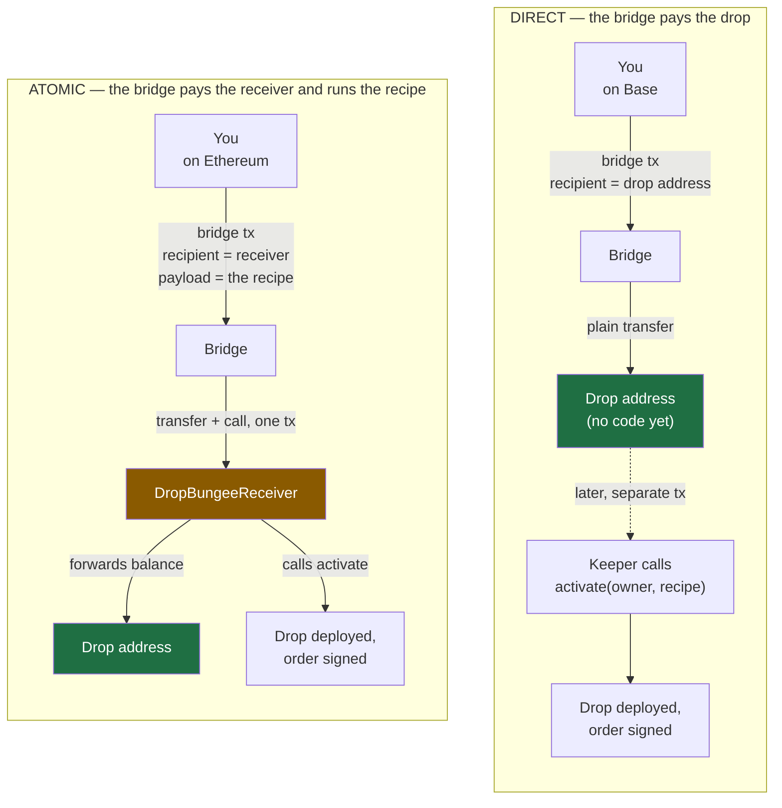

# Bridging into a drop

How money gets from another chain into a drop, why there is a contract in the middle, how a delivery
can get stuck — and how one got stolen. For the design of drops themselves see
[DESIGN.md](DESIGN.md); for addresses see [DEPLOYMENTS.md](DEPLOYMENTS.md).

## The one idea everything rests on

A drop address is a hash commitment to a recipe. Change one byte of the recipe and you get a different
address, so an address *is* the proof of which recipe belongs to it — no signature needed, and anyone
may run it.

That has a consequence which is unusual and very convenient: **the address works as a destination
before it exists as a contract.** You can send money to it, and the recipe spends whatever turns up
later. Nobody has to know in advance how much will arrive.

Which is exactly the shape of a bridge payout. You do not control the amount (fees are taken) or the
timing (fills take minutes). A normal contract would have to be deployed first and told a number; a
drop just needs the money to land.

## Two ways to fund one from another chain

**Direct** asks nothing of the bridge except a transfer, so every bridge can do it. **Atomic** needs a
bridge that will carry and execute a payload on the destination chain, which only some will.

## Why the receiver exists at all

If direct is simpler and works everywhere, why build the receiver? Three reasons, and the third is the
one that gets overlooked.

1. **The order is live immediately.** In direct mode the money lands and then waits for somebody to
   activate it. In atomic mode the fill *is* the activation, so the order exists the moment the bridge
   settles.

2. **Somebody else pays the gas.** Activation costs about 420,000 gas on the destination chain. In
   atomic mode the bridge relayer pays it, out of a fee you already paid on the source chain. In direct
   mode it comes from a keeper's hot wallet, or from you.

3. **The recipe travels with the money.** This is the subtle one. `setupData` — the encoded recipe — is
   both the commitment *and* the deploy instruction. Nothing on-chain stores it; `DropTriggered` emits
   only its hash. So normally, **if you lose the recipe file before activating, the money is gone
   forever** — for you and for everyone, because the owner's rescue path needs the same bytes everyone
   else does.

   Putting the recipe in the bridge payload publishes it as calldata on the destination chain. It is
   the one path where losing your copy is survivable.

### "Why not just call `DropExecutor` directly?"

The obvious question, and the answer is a property of bridges rather than a choice we made.

**A bridge pays one address and calls that same address.** Bungee transfers the tokens to
`receiverAddress` and then calls `receiverAddress.executeData(bytes32, uint256[], address[], bytes)`.
Across, LiFi and Stargate all work the same way, for the same reason: whoever runs the logic needs the
tokens in hand, so the recipient *is* the callee. You do not get to name them separately.

So "make the destination calldata an `activate(owner, setupData)` call" is not on the menu. The bridge
does not take a target and a calldata blob; it takes an address and a payload, and it calls one fixed
function on that address.

Try the two obvious candidates and both fail, in instructive ways:

| `receiverAddress` = | Tokens land | The call |
|---|---|---|
| `DropExecutor` | at `DropExecutor`, which has no sweep and no fallback | reverts — it has four functions and `executeData` is not one of them |
| the drop address | correctly, at the drop | does nothing. Undeployed, it is a call to an address with no code, which silently "succeeds"; once deployed, the proxy delegatecalls `COWShed`, which has no `executeData` either, and reverts |

The second row is worth sitting with, because it is *almost* right. The money goes exactly where it
should — that is direct delivery — and the only thing missing is that nothing calls `activate`. You
cannot fix it by putting the call in the payload, because the code that would receive it is the code
you are trying to deploy.

**And `executeData` cannot simply be added to `DropExecutor`.** Its address is both the
`trustedExecutor` and the `setupTarget` in every drop's CREATE2 preimage, so a new function means new
bytecode, a new address, and a different address for every drop that has ever been computed — including
ones already funded against a recipe file somebody is holding. That is what generations exist to
prevent.

So the receiver does exactly two jobs, and neither is optional:

1. **Translate the ABI** — `executeData(...)` in, `activate(owner, setupData)` out.
2. **Move the tokens** — from the address the bridge paid to the address the drop lives at.

Job 2 is the fundamental one, and it is also the whole problem. The bridge pays the callee, the drop
needs the money, and those are different addresses by construction — so *something* has to hold the
tokens for an instant in between. A contract that holds other people's tokens for an instant is a
contract that holds them indefinitely when the call never comes.

Which points straight at the fix, and it is the one this question keeps circling: make the in-between
contract **per drop**. Then "the address the bridge paid" and "an address only this drop can drain" are
the same address, and there is nothing in between to steal from. That is option C below.

## Who activates, and what happens if nobody does

There is a ladder, and each rung is a fallback for the one above:

| | Who | When |
|---|---|---|
| 1 | The bridge itself | Atomic mode only — inside the fill |
| 2 | The keeper | Any mode, if the drop was registered before the money was sent |
| 3 | You | The **Activate** button, any time |
| 4 | The owner's rescue | If the recipe can never succeed — sweeps the funds back out |

Rungs 3 and 4 need the recipe bytes. Rung 2 needs the keeper to have been told the recipe *before* the
money moved, which is why the UI registers first and sends second. The keeper is also the only holder of
the appData pre-images the order book needs, so without it an order with custom appData is rejected even
though the pre-signature is on-chain.

Note what is **not** on this ladder: nothing recovers a delivery that never reached the drop. That is the
next section.

## How a delivery gets stuck

Atomic mode has two failure modes, and they look identical from the outside.

**The bridge never calls us.** Bungee's quote API accepts `destinationPayload` and echoes it back —
send it `0xdeadbeef` and `0xdeadbeef` comes back — but the echo means nothing. No field on a route says
whether the bridge will actually run it, and some simply do not. Symbiosis quotes happily and then
delivers with a plain transfer.

**The call happens and fails.** A guard refuses, the recipe is malformed, or the prepaid destination gas
runs out.

The contract is careful about the second case: forwarding and activation happen together in an external
self-call under `try/catch`, so a failed activation rolls the token forwarding back with it and the
`onFailure` branch still has the tokens to place. And a malformed payload simply reverts, which is safe
because the bridge's transfer and its call are the same transaction — reverting undoes the transfer too.

**None of that helps in the first case,** because the bridge never entered our code at all. The tokens
are already at the receiver and nothing of ours ran.

## How stuck became stolen

`DropBungeeReceiver` is shared by everyone and `executeData` is permissionless — it has to be, because a
bridge relayer is the caller and there is no way to know every relayer's address in advance. It forwards
its **whole balance** to whichever drop the payload names.

So a stranded balance is not merely stuck. It is a public bounty: anyone can call `executeData` with a
payload naming a drop of *their* own and take everything sitting there. They do not need to see your
transaction — the balance is visible on-chain the moment it lands.

That is not hypothetical. It has happened: a stranded balance was swept into a stranger's drop, and the
recovery transaction landed in the *same block*, one transaction position later, and found nothing left
to move. The recovery was not slow; it was simply second.

The design note in `DropDelivery.sol` called this "inherent to a permissionless delivery endpoint". That
was wrong, and it is worth being precise about why: permissionless *entry* is genuinely required, but
permissionless *choice of destination* is not. The receiver lets its caller pick where the money goes,
and that is the actual defect.

## Why direct mode cannot fail this way

In direct mode there is no shared contract in the path. The money goes to the drop address, and that
address is derived from one specific recipe belonging to one specific owner. The only things that can
move it are that recipe, or that owner's rescue.

There is nothing to race for, because there is nothing an attacker could point at themselves. A delivery
that nobody activates is simply *waiting* — indefinitely, safely — until someone with the recipe acts.

The trade is latency: the order is live one keeper tick after the money lands, rather than in the fill
itself.

Direct mode also has a bonus that matters right now. Because it asks nothing of the bridge, **every**
bridge qualifies — including the ones that ignore payloads. Atomic mode can only use a bridge that has
been *watched* running a destination payload, and none has been, so atomic currently has no route at
all. In direct mode, Base→Gnosis works.

## Options to improve

| | Option | Closes the theft? | What it costs |
|---|---|---|---|
| **A** | Allowlist bridges that really execute payloads *(withdrawn)* | **No** — and it was worse than nothing | Far fewer routes, and a false sense of safety. See below |
| **B** | Restrict `executeData` to known bridge callers, plus an owner-only `rescue` | Yes | A per-chain immutable holding each bridge's executor address — which must be found, and stays correct only until a bridge redeploys. Fails closed, but silently |
| **C** | A per-drop receiver at `CREATE2(owner, setupData)`, whose code can only ever pay that one drop | Yes | One extra deploy per drop on the destination chain, before bridging. Needs no external address to stay true |
| **D** | Make direct delivery the default, atomic opt-in *(done)* | Removes the exposure for anyone who does not opt in | Loses atomicity — a keeper tick, not instant |
| **E** | Verify the provider's answer, and make an unverified transaction unobtainable *(done)* | **No** — but it makes both failure modes visible before signing | A blocking check on a response encoding is a hard dependency on that encoding |

**A was tried and withdrawn, and the way it failed is the most useful thing in this document.** It was a
constant naming three bridges believed to execute payloads. Nothing ever compared it to a response, two
of the three had never been observed working, and the third could not work at all — its destination ABI
is `onTokenBridged(address,uint256,bytes)` on the recipient, which can never reach the receiver's
`executeData(bytes32,uint256[],address[],bytes)`. Since it was also the only entry serving
Ethereum→Gnosis, the single pair the allowlist claimed to protect was the pair it silently broke. A
safety mechanism that cannot fail visibly is worse than none, because it is trusted.

B is the conventional fix and the cheapest. Its weakness is that its correctness lives outside the
contract, in an address that some other team controls.

C is the strongest. Give every drop its own receiver, derived from the same `(owner, setupData)` the drop
is, and a stranded balance can only ever go to that one drop — the bounty disappears because there is
nothing to redirect. The cost is real though: the receiver must be deployed *before* bridging, or the
bridge's call hits an address with no code and we are back to a plain transfer.

D costs nothing and helps immediately.

E is what replaced A, and it is worth being exact about what it does and does not do. It cannot make
atomic delivery safe — a bridge that reverts on arrival still strands the tokens, and no quote-time check
can see that coming. What it does is refuse to let anything be signed that has not been checked against
the request that produced it: every route carries a verdict with its reason, the transaction's bytes are
searched for the destination and the payload, and `sendableTransaction()` is the only route from a quote
to a wallet. The registry behind it records *observations* rather than beliefs — an entry cannot be
promoted without a transaction hash — which is precisely what A lacked.

## Recommendation

**D and E are done.** Direct delivery is the default and the only mode currently on offer, because no
bridge has been watched running a destination payload; the registry is empty of observations, and that is
the honest state rather than a gap to be filled by assertion.

**Then C, if atomic is worth keeping.** Its correctness is self-contained, which for a contract holding
other people's money in transit is worth more than the deploy it costs. B is the fallback if the per-drop
deploy proves too awkward in practice. Either way, an `observed` entry in the registry should come from
watching a real fill, not from reasoning about one.

Until then, treat any balance sitting at `DropBungeeReceiver` as **actively contested** — it will be
taken, and quickly. Recovering one means racing a bot, so send the recovery through
[Gnosis's Shutter encrypted mempool](https://docs.gnosischain.com/shutterized-gc/)
(`https://erpc.gnosis.shutter.network`, minimum 1 gwei priority fee) rather than the public one.
