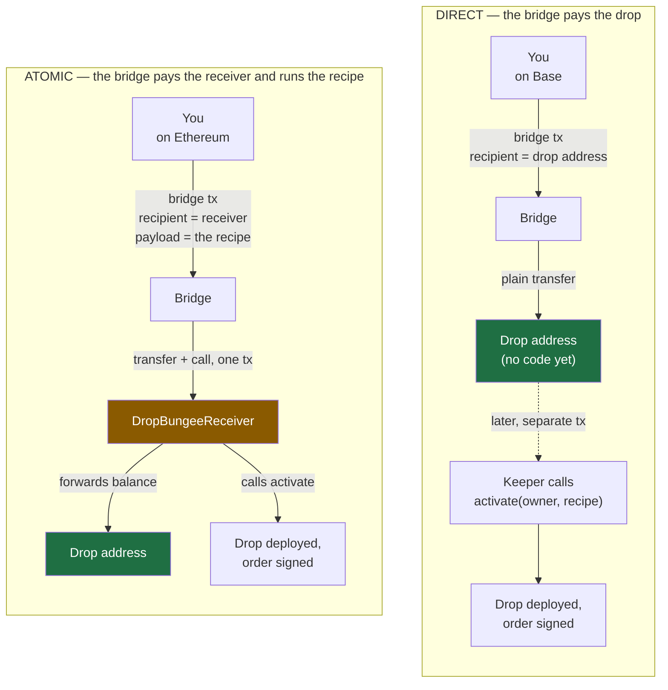
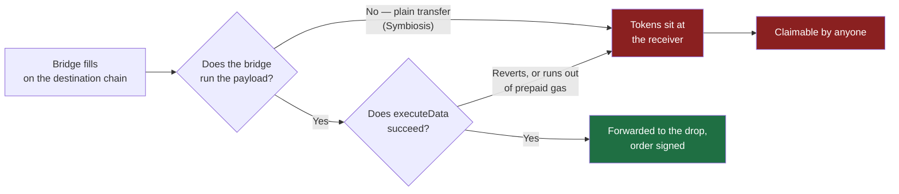

# Bridging into a drop

How money gets from another chain into a drop, and why there is a contract in the middle. For the
design of drops themselves see [DESIGN.md](DESIGN.md).

A drop address is a hash commitment to a recipe, which means **it works as a destination before it
exists as a contract**. You can send money to it and the recipe spends whatever turns up later.

That is exactly the shape of a bridge payout: you control neither the amount (fees are taken) nor the
timing (fills take minutes). A normal contract would have to be deployed first and told a number.

## Two ways to fund one

**Direct** asks the bridge for nothing but a transfer, so every bridge can do it. **Atomic** needs a
bridge that carries and executes a payload on the destination chain, which only some will.

**Direct is the default and currently the only mode on offer** — no bridge has been observed running a
destination payload, so atomic has no eligible route.

## What atomic delivery buys

1. **The order is live immediately.** The fill *is* the activation.
2. **Somebody else pays the gas.** Activation costs ~420,000 gas, paid by the bridge relayer out of a
   fee you already paid on the source chain, rather than by a keeper's hot wallet.
3. **The recipe travels with the money.** Putting `setupData` in the bridge payload publishes it as
   calldata on the destination chain — the one path where losing your own copy is survivable.

### Why the receiver exists

A bridge pays one address and calls that same address. Bungee transfers tokens to `receiverAddress`
and then calls `receiverAddress.executeData(bytes32, uint256[], address[], bytes)`; Across, LiFi and
Stargate all work the same way, because whoever runs the logic needs the tokens in hand. You do not
get to name the recipient and the callee separately.

So the two obvious candidates both fail:

| `receiverAddress` = | Tokens land | The call |
|---|---|---|
| `DropExecutor` | at `DropExecutor`, which has no sweep and no fallback | reverts — `executeData` is not one of its functions |
| the drop address | correctly, at the drop | does nothing. Undeployed, a call to a codeless address silently "succeeds"; once deployed, `COWShed` has no `executeData` either |

And `executeData` cannot be added to `DropExecutor`: its address is both the `trustedExecutor` and the
`setupTarget` in every drop's CREATE2 preimage, so a new function would move every drop address ever
computed.

The receiver therefore does two jobs — **translate the ABI** (`executeData` in, `activate` out) and
**move the tokens** from the address the bridge paid to the address the drop lives at. Job 2 is the
whole problem: something has to hold the tokens for an instant in between.

> **Warning — do not leave a balance at `DropBungeeReceiver`.** It is shared by everyone,
> `executeData` is permissionless by necessity (a bridge relayer is the caller), and it forwards its
> **whole balance** to whichever drop its caller names. Any balance sitting there is claimable by
> anyone, immediately. Direct delivery has no shared contract in the path and no such exposure.

Off-chain, `bungeeDelivery()` in the SDK builds the payload and
[`packages/bridging`](../packages/bridging/README.md) quotes the route. The payload contains no amount,
so re-quoting a route can never move the address the quote is aimed at.

## Who activates, and what if nobody does

Each rung is a fallback for the one above:

| | Who | When |
|---|---|---|
| 1 | The bridge itself | Atomic mode only — inside the fill |
| 2 | The keeper | Any mode, if the drop was registered before the money was sent |
| 3 | You | The **Activate** button, any time |
| 4 | The owner's rescue | If the recipe can never succeed — sweeps the funds back out |

Rungs 3 and 4 need the recipe bytes. Rung 2 needs the keeper to have been told the recipe *before* the
money moved, which is why the UI registers first and sends second — it is also the only holder of the
appData pre-images the order book needs.

Nothing on this ladder recovers a delivery that never reached the drop.

## How an atomic delivery gets stuck

**The bridge never calls us.** Bungee's quote API accepts `destinationPayload` and echoes it back, but
the echo means nothing — no field on a route says whether the bridge will actually run it, and some
simply do not.

**The call happens and fails.** A guard refuses, the recipe is malformed, or the prepaid destination
gas runs out. The contract handles this case: forwarding and activation happen together in an external
self-call under `try/catch`, so a failed activation rolls the forwarding back and the `onFailure`
branch still holds the tokens to place. A malformed payload simply reverts, which is safe because the
bridge's transfer and its call are one transaction.

Neither helps in the first case — the bridge never entered our code.

## Options to close the exposure

| | Option | Closes it? | What it costs |
|---|---|---|---|
| **B** | Restrict `executeData` to known bridge callers, plus an owner-only `rescue` | Yes | A per-chain immutable holding each bridge's executor address, which stays correct only until a bridge redeploys. Fails closed, but silently |
| **C** | A per-drop receiver at `CREATE2(owner, setupData)`, whose code can only ever pay that one drop | Yes | One extra deploy per drop on the destination chain, before bridging. Needs no external address to stay true |
| **D** | Make direct delivery the default, atomic opt-in *(done)* | Removes the exposure for anyone who does not opt in | Loses atomicity — a keeper tick, not instant |
| **E** | Verify the provider's answer, and make an unverified transaction unobtainable *(done)* | No — but it makes both failure modes visible before signing | A blocking check on a response encoding is a hard dependency on that encoding |

**C is the strongest.** Give every drop its own receiver derived from the same `(owner, setupData)`
and a stranded balance can only ever go to that one drop — there is nothing to redirect. The cost is
that it must be deployed *before* bridging, or the bridge's call hits a codeless address.

B is cheaper but its correctness lives outside the contract, in an address another team controls.

E cannot make atomic delivery safe — a bridge that reverts on arrival still strands the tokens, and no
quote-time check sees that coming. What it does is refuse to sign anything unchecked: every route
carries a verdict with its reason, the transaction's bytes are searched for the destination and the
payload, and `sendableTransaction()` is the only route from a quote to a wallet.

**Recommendation: C, if atomic is worth keeping.** A contract holding other people's money in transit
should have self-contained correctness. B is the fallback. Either way, promoting a bridge to `observed`
should come from watching a real fill.
