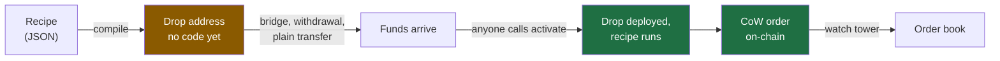

# Design

What a drop is and why it works. For build and run instructions see the [README](../README.md).

## What a drop is

An address that already knows what to do with the money you send it.

You describe what should happen — *sell whatever arrives for COW*, *split it into 12 parts over 12
hours* — and that description compiles to an address. Send funds there and anyone can trigger it. No
signature, ever, because the instructions are hashed into the address itself.



## The rule

A cow-shed address normally commits to one thing, its owner. Using
[cow-shed#64](https://github.com/cowdao-grants/cow-shed/pull/64)'s deploy-time setup call, a drop
address commits to a **recipe** instead:

```
salt = keccak256(abi.encode(owner, trustedExecutor, userSalt, setupTarget, keccak256(setupData)))
```

`setupData` is the recipe. Change one byte and you get a different address, so nobody can substitute
a different recipe at this one. **The address is the authorization.**

| property | why |
|---|---|
| **Permissionless** | Anyone can activate: a keeper, a solver pre-interaction, a stranger. No privileged sender, nothing to steal. |
| **Fundable before it exists** | Funds sent to the counterfactual address are spent by the recipe on activation. This is what makes it work behind a bridge. |
| **Never commits to an amount** | Steps run as delegatecalls, so `balanceOf(address(this))` is what actually arrived. A drop commits to *"split whatever lands here into 12 parts"*, not to a number. |
| **Recoverable — with the recipe** | Two owner-only rescue paths, neither needing a signature. Both need the recipe bytes, and only their hash is on-chain. |

> **Losing a recipe after funding loses the money, for everyone including the owner.** The recipe
> file is the key, not a convenience.

## Two order paths

| | Path P — pre-sign | Path C — composable |
|---|---|---|
| Step | `PresignSteps.presignSellAll` | `TwapSteps.twapFromBalance` |
| Needs ERC-1271 | no | yes, forwarded by `DropExecutor` |
| Needs a watch tower | no | yes, and it is automatic |
| After activation | an off-chain poster submits the order | self-driving; each part is posted for you |
| Good for | swap whatever arrived, once | TWAP and anything recurring |

Both share one implementation, `COWShedWithExecutorSigner`, whose ERC-1271 delegates to the shed's
trusted executor — `DropExecutor` for a drop. That is what lets us reuse the cow-shed contracts
already deployed rather than shipping a variant. Details in
[`contracts/ARCHITECTURE.md`](../contracts/ARCHITECTURE.md).

## The recipe format

The JSON is the authoring surface; the compiled `setupData` bytes are the commitment. The file is a
reproducible way back to those bytes, so compilation reads fields by name in a fixed order and never
depends on key order or formatting. Export a recipe, reload the page, import it, and the same address
comes back — no server, no database.

```json
{
  "version": 1,
  "generation": 1,
  "label": "WXDAI -> COW over 12h",
  "chainId": 100,
  "owner": "0x…",
  "salt": "0x00…00",
  "once": true,
  "steps": [
    {
      "type": "twapFromBalance",
      "sellToken": "0xe91D153E0b41518A2Ce8Dd3D7944Fa863463a97d",
      "buyToken": "0x177127622c4A00F3d409B75571e12cB3c8973d3c",
      "parts": 12,
      "partDuration": 3600,
      "limitPrice": { "price": "45", "sellDecimals": 18, "buyDecimals": 18 }
    }
  ]
}
```

`generation` says which deployment of the contracts to compile against. Step addresses live inside
the committed bytes, so the same file against a later generation resolves to a *different* address —
see [DEPLOYMENTS.md](DEPLOYMENTS.md).

Limit prices are exact integer fractions, never floats: a rounding difference between the UI and the
SDK would be a different address, not a slightly different price.

Adding a capability is a new entry in `packages/sdk/src/steps.ts` plus a primitive under
`contracts/src/steps/`. `{"type": "raw"}` is the escape hatch.

## Security

One invariant carries the design.

`COWShed.trustedExecuteHooks` is `onlyTrustedRole` and takes **no nonce, no deadline, no signature**.
`DropExecutor` is the trusted executor of every drop. So a `setup` implementation that merely decoded
`setupData` and forwarded the calls would let anyone call `setup(someoneElsesDrop, …, arbitraryCalls)`
and **drain every drop in the system**.

`DropExecutor._run` therefore re-derives the address from `(owner, setupData)` and requires it to
equal the shed it is acting on, on *every* entry point. A recipe that does not reproduce the address
is not that address's recipe.

Two consequences that are easy to miss:

- **Drops are re-triggerable**, since `trustedExecuteHooks` consumes no nonce — which is what makes a
  reusable deposit address work. Set `"once": true` for one-shot recipes.
- **Activation is permissionless, so "nobody triggers this early" is not a promise anyone can make.**
  Guard one-shot recipes with `requireMinBalance`; without it, the first bridge tranche to land sizes
  the whole schedule. `allowFailure` + `once` is refused at compile time, since together they are
  burnable by anyone.

Never discover a drop from `ownerOf` or `COWShedBuilt` — `initializeProxyWithSetup` is permissionless,
so anyone can create a shed reporting someone else as owner. Always recompute the address client-side
from the parameters you intend before funding.

### Rescue

A drop is funded before it exists, so a recipe that can never succeed would strand the money.
`initializeProxyWithSetup` always runs the setup, so there are two hatches — which applies depends
only on whether the drop is deployed:

| drop state | mechanism | SDK |
|---|---|---|
| not deployed | `initializeProxyWithoutSetup` ([cow-shed#78](https://github.com/cowdao-grants/cow-shed/pull/78)) — deploys at the same address, skips the recipe, sweeps in the same transaction | `buildRescueTx` |
| deployed | `trustedExecuteHooks` — the owner is the shed's admin, so no hatch and no signature are needed | `buildOwnerSweepTx` |

`buildRescueForState` picks between them. Both are owner-only, which is what keeps ordinary drops safe
to fund. The sweep runs in the *same* transaction as the deployment because the committed trusted
executor is trusted the moment the shed exists.

`buildDeployOnlyTx` is the "just give me the account" variant: deploy the shed, skip the recipe, drive
it as an ordinary cow-shed.

One consequence: **a drop's address no longer proves its recipe ran.** Anything inferring that must
check the recipe's effects or watch for `SetupSkipped`.

**Unaudited, and it depends on an unmerged four-deep PR stack. Do not put real money in it yet.**

## Where to read next

| | |
|---|---|
| [`contracts/ARCHITECTURE.md`](../contracts/ARCHITECTURE.md) | Every contract, the step catalogue, why the split is what it is, and how an order is announced |
| [DEPLOYMENTS.md](DEPLOYMENTS.md) | Generations, what is deployed where, and verification |
| [BRIDGING.md](BRIDGING.md) | Funding a drop from another chain |
| [`packages/sdk/API.md`](../packages/sdk/API.md) | The function reference |
| [`packages/watch-tower/ARCHITECTURE.md`](../packages/watch-tower/ARCHITECTURE.md) | How on-chain orders get to the order book |
| [`packages/keeper/ARCHITECTURE.md`](../packages/keeper/ARCHITECTURE.md) | Unattended activation, and what it will pay for |
| [`apps/web/ARCHITECTURE.md`](../apps/web/ARCHITECTURE.md) | The demo page |

## Status

Working end-to-end on a Gnosis fork: a third party funds a counterfactual address, activates it, and
the real `GPv2Settlement` records the pre-signature for an order sized to the balance that arrived.

Not done: broadcast to Gnosis (needs a funded deployer), and activation is still manual for drops not
handed to a [keeper](../packages/keeper/README.md). A solver pre-interaction is the better answer for
a real product.

## Known constraints

- **Nothing upstream is merged.** The stack is cow-shed `#61 → #64 → #67 → PR2`. Any change to the
  shed implementation moves **every** drop address, which is why deployments are cut as numbered
  generations. Expect the counter to move.
- **Poller JIT funding is unavailable.** `ComposableCowPoller.registerFromShed` rejects sheds from
  `COWShedExecutorFactory` (composable-cow#145). The objection does not apply to a
  commitment-verifying executor, but the check is address-scheme-based.
- `proxyOf` / `executeHooks` / `initializeProxy` are overloaded on the executor factory. Always use
  full signatures; bare-name encoding is ambiguous in both ethers and viem.
- Someone pays gas for activation. A real product wants a solver pre-interaction or a fee inside the
  recipe.
- **Path C is TWAP only.** No single-shot limit-order handler exists on composable-cow `main`:
  `TradeAboveThreshold` has `buyAmount = 1`, and composable-cow#82's `LimitOrder` is verify-only, so
  `getTradeableOrderWithSignature` reverts. A ~60-line `BaseConditionalOrder` generator would cover it.

## Related work

- [`bridge-and-swap`](https://github.com/cowprotocol/bridge-and-swap) →
  [`orderflow-contracts#1`](https://github.com/cowprotocol/orderflow-contracts/pull/1) — same problem,
  narrower commitment: one order per bespoke contract. `DropBungeeReceiver` is modelled on its
  `OrderFlowFactory.executeData` (`getOrderFlowAddress` ≈ `dropOf`, `triggerOrderCreation` ≈ `activate`).
- [cow-sdk#845](https://github.com/cowprotocol/cow-sdk/pull/845) adds a `BridgeThenSwapProvider` aimed
  at `OrderFlow`. `packages/bridging` mirrors its shape with the destination as a value, which is the
  generalization that would let one implementation serve both.
- [`approve-and-bridge`](https://github.com/cowprotocol/approve-and-bridge) is the outbound mirror
  (swap then bridge, as a post-hook).
