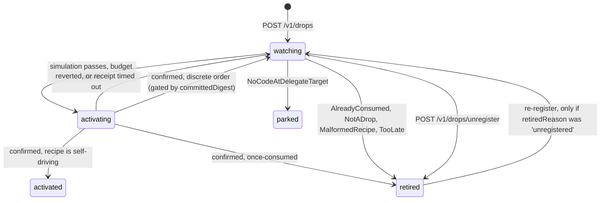

# Keeper architecture

How the keeper decides what to activate, what it will pay for, and what it does when things go wrong.
Running it is covered in the [README](README.md).

Two loops run side by side: **the keeper activates, the watch tower posts.** An in-process
[`watch-tower`](../watch-tower/README.md) turns the resulting `OrderPlacement` logs into posted orders,
with the retry and cursor semantics it already has. One implementation of order posting rather than
two, at the cost of `order-posted` arriving a poll or two after the receipt.

## Readiness is decided by simulation

Decoding the guards and evaluating them does not work: `requireCallResult` leaves its inner calldata
undecoded by design, a `raw` step is opaque entirely, `token: 0x0` means native rather than an ERC20,
and the guarded token need not be the sell token.

So the recipe is a **hint** — it says which balances are worth polling — and the gate is an `eth_call`
of `buildActivateTx` itself. That evaluates every guard correctly, including ones no decoder can read,
plus `NothingToSell`, `AlreadyConsumed` and `NoCodeAtDelegateTarget`.

The balance poll only keeps that call cheap: a drop whose balances have not moved since the last
simulation is not simulated again until `resimulateIntervalMs`. A recipe of nothing but `raw` steps has
nothing to poll, so it is simulated on a timer instead — latency, not correctness.

## The drop lifecycle



`activated` is where a recipe that registered a conditional order parks; the tick loop never considers
it. Re-arming a TWAP is expensive and cannot be gated: the drop holds its sell balance for the whole
schedule, `twapFromBalance` reads that balance at activation and passes `t0 = 0`, so a second activation
either registers a second TWAP over the remainder or re-seeds the cabinet and restarts over parts that
already traded. The balance *falls as parts fill*, so no balance-watching gate holds it, and nothing
off-chain can tell a finished schedule from a running one.

A recipe that signs discrete orders comes back to `watching` instead. Parking those was a bug: a
reusable deposit address that fires exactly once is not reusable.

## Activating twice is the risk, not activating once

The money does not leave at activation. The pre-signature is on chain, the order is valid, and the
balance `presignSellAll` sized it against sits in the drop until a solver settles. Simulating on that
balance passes, so without a gate the next tick signs a second order for the same money — one the first
order's fill makes unfillable, bought with the keeper's gas.

A confirmed activation therefore records `committedDigest`, the balances it committed. `shouldSimulate`
refuses while the polled digest still matches, and the commitment ends on whichever comes first:

- **the balance moves** — a fill, a sweep, or a fresh arrival. A latch cleared on movement rather than a
  comparison against the committed value, so a refund of exactly the last order's size still counts as
  new money.
- **the order can no longer fill** — `validTo`, read from the last four bytes of the uid the watch tower
  posted onto the activation record. This is the half that matters when an order expires unfilled, since
  the balance never moved. Before a uid exists the recipe's own validity window stands in, measured from
  the receipt, which errs late.

## Registration

```
POST /v1/drops            { recipe, address } -> 201 { drop }, or 200 if already registered
GET  /v1/drops?owner=0x…  -> every drop registered under one owner, newest first
GET  /v1/drops/:address   -> the drop, its hints, and its activation history
POST /v1/drops/unregister { recipe } -> 200, 409 while an activation is in flight
GET  /v1/events?drop=0x…  -> SSE
GET  /v1/health           -> payer, balance, budget left, counts
GET  /v1/policy           -> whether it is subsidising, before anyone commits
GET  /v1/about            -> chain, generation, and the contract addresses those stand for
GET  /v1/openapi.json     -> this surface as an OpenAPI 3.1 document
GET  /v1/docs             -> Swagger UI over that document
```

That list is generated at runtime from `ROUTES` in `src/server.ts`, which also feeds the boot banner.
`src/server.test.ts` walks it and asserts every entry answers something other than 404.

**The client sends the address it derived and the server compares it to its own; a mismatch is a 409
naming both.** That catches SDK-version skew, whose failure is otherwise silent — the keeper would
diligently watch an address nobody funded while the user watches the one they did. The client's address
is an assertion to be checked, never an input. `/v1/about` publishes the same check one level up, so a
client can compare deployments key by key before it ever compiles a recipe.

`POST` is idempotent, because a client whose request timed out will retry. Re-registering an
unregistered recipe *resumes* that record, so the pair is a pause the recipe holder can undo. Only
`retiredReason: 'unregistered'` revives — every other reason is a fact about the drop (`once-consumed`
cannot fire twice, `expired` is past its window, `terminal-revert` would revert again), and polling for
those is polling for something that cannot happen. A resume restores the state the stop interrupted,
derived from the activation history rather than remembered in a field that would go stale.

**Registration is open; unregistration is not symmetric.** Registering someone's drop grants nothing —
activation is permissionless already, the guards are committed into the address, and only the owner can
sweep. Unregistering someone else's costs them their subsidy for free, so it takes the recipe in the
body, which proves the caller holds the one thing that matters. A subscription token would be another
thing to store, lose on restart and leak, and would grant exactly what holding the recipe already proves.

**Unregistering is refused while an activation is in flight** — a 409 naming the transaction. Retired
drops are excluded from `store.active()` and only active drops get their `pending` reconciled, so
retiring mid-flight would abandon a transaction the keeper has already paid for. A second later the tick
has reconciled and the same request succeeds.

What registration costs is capacity: a recipe stored indefinitely and a line in every tick's poll set.
Hence `--max-drops` and a body cap.

### Listing by owner

`GET /v1/drops?owner=…` requires the owner. Unfiltered, this is a dump of every recipe the keeper holds
for everybody — an operator's view, and the cheapest way to make the process serialise its whole
registry. `/v1/events` refuses an unfiltered stream for the same reason.

- **A malformed owner is a 400, not an empty 200.** A typo and an empty registry must not read the same.
  The chain is in the envelope because the empty answer carries no drops to read it from.
- **Retired drops are included**, with no filter to exclude them. The drop nothing is watching may be
  holding money, and a `?status=` filter defaulting to live would hide the dangerous state.
- **No pager.** The response is capped (`maxListed`, 200 by default) and reports `total` and `truncated`,
  keeping the **newest**. A keyset cursor over a store whose `all()` is a full scan would be a pager for
  a query the store cannot serve efficiently anyway.
- **A row is not an ownership claim.** The keeper compiled every recipe it holds, so a row is a
  consistent triple of address, recipe and owner — unlike `ownerOf` on a deployed shed. But registration
  is open and `owner` is a field of the *submitted* recipe, so a row means *"someone registered a recipe
  naming this address as owner"*, never *"you made this"*. A client must never turn a row into an
  invitation to fund.
- **What it discloses.** The shape is `toWire`, so this route can never expose more than
  `GET /v1/drops/{address}` already does: no `recipe`, no `setupData`, no `appDataDocuments`, no fee, no
  simulation state. Keeping `setupData` out is not only privacy — it is the activation authority, and a
  one-shot recipe with no minimum-balance guard can be burned by anyone. What is new is the
  **aggregate**: everything one owner is waiting on, and how much is in each.

## Money

Three modes. `all` subsidises everyone, `allowlist` a fixed set of owners, and **`paying` anyone whose
recipe pays the keeper more than the activation costs** — the only one whose limit is economic rather
than administrative, and so the only one that safely scales to strangers.

### `paying`

```json
{
  "mode": "paying",
  "feeRecipient": "0xKeeper…",
  "minFeeBps": 5,
  "minRevenueRatio": 1.5,
  "dailyBudgetWei": "250000000000000000"
}
```

A drop qualifies when its order carries a CoW `partnerFee` naming the keeper:

```json
{ "version": "1.4.0", "metadata": { "partnerFee": { "volumeBps": 10, "recipient": "0xKeeper…" } } }
```

That costs no gas and needs no contract of ours — it is the protocol's own mechanism, taken at
settlement. The keeper values it with the order book's native price and refuses unless it clears the gas
by `minRevenueRatio`.

**The chain carries only the appData hash, so the document must be supplied at registration.** The keeper
hashes the exact bytes it was handed and compares them to what the recipe committed to; a fee in a
document nobody signed is not a promise. It hashes the string verbatim and never re-serialises, since
JSON has many spellings of one object and only the one that was hashed is the pre-image.

Two deliberate narrowings:

- **Only `volumeBps` counts.** A `surplusBps` fee is real income whose *guaranteed* value is zero — a fill
  with no surplus pays nothing.
- **`minRevenueRatio` sits above 1.** The volume is the balance a poll saw, the order is sized at
  activation, and the price moves in between.

An unpriceable sell token is a refusal, not a zero. The documents are kept for a second job: the order
book rejects an appData hash it has never seen, so the watch tower needs them to post at all.

**Confirm the price convention before turning this on with real money.** `feeValueWei` assumes CoW's
native price converts atomic token units to wei, which the SDK's `{ price?: number }` type does not state.
`--dry-run` logs estimated revenue beside gas for every drop, so a wrong convention shows up as orders of
magnitude.

### `all` and `allowlist`

```json
{
  "mode": "all",
  "denylist": [],
  "maxCostPerActivationWei": "10000000000000000",
  "maxFeePerGasWei": "500000000000",
  "dailyBudgetWei": "250000000000000000",
  "perOwnerDailyBudgetWei": "50000000000000000",
  "minPayerBalanceWei": "20000000000000000"
}
```

- **`minPayerBalanceWei` and `maxCostPerActivationWei` are chain-sized defaults, not constants.** Both
  default to twenty activations, computed at boot from `eth_gasPrice` and the measured ~420k gas an
  activation burns; the values above are what a caller with no chain information falls back to. See the
  [README](README.md#cli) for the numbers and why they cannot be flat. A file that sets only some fields
  inherits the chain-sized rest.
- **The per-activation cap is in wei, not gas units.** A units cap does not bound spend: the same 300k gas
  costs thirty times more in a fee spike. `maxFeePerGasWei` is the separate breaker that pauses the keeper
  in a spike. Sizing the *default* from the gas price is different — it is picked once at boot and then
  holds still, so it remains a cap.
- **Budgets stay absolute.** `dailyBudgetWei` is risk appetite, and scaling it by gas price would raise the
  ceiling on the chain where a mistake costs most.
- **`perOwnerDailyBudgetWei` barely binds in `mode: "all"`,** since `owner` is a field of a recipe anyone
  may submit and minting a fresh one is free. Set `dailyBudgetWei` to a number you would not mind losing
  daily. Simulation kills the cheap abuse, but a valid, useless, repeatedly-registered drop can still
  drain a day's allowance. The per-owner cap earns its place in `allowlist` mode.

`paying` is the answer to that: an attacker draining the budget has to pay you more than they cost.

The hot key is read from `--private-key-file` or `$KEEPER_PRIVATE_KEY`, never from argv — `--private-key`
is rejected rather than ignored, since an argument is visible in `ps`. It sits behind a `Submitter`
interface, so a relayer or Safe replaces it without touching the loop.

## Crash safety

`Submitter` is two-phase — `prepare` then `broadcast`. Signing locally yields the transaction hash
*before* any bytes leave the process, so the record moves to `activating` with the hash recorded, and the
budget is debited, before the broadcast. A crash in that window leaves a hash to look up rather than a
question about whether anything was sent.

The budget is debited at the reservation and settled from the receipt. Over-counting a transaction that
never goes out is the safe direction — reconciliation refunds it — whereas under-counting means a crash
loop can spend past the daily cap.

On restart the watch tower's cursor is rewound to the oldest in-flight activation's block. Without that,
a restart between broadcast and scan skips the block the activation landed in, and its orders are never
posted.

## Reverts

**An unrecognised selector is always `waiting`, never `terminal`.** The decoder is the lossy part of this
system — a `raw` step's target has its own errors, and a future step contract will have errors this build
has never heard of — so if an unfamiliar revert could retire a drop, one unknown error would stop the
keeper watching an address that is alive and about to be funded. Being wrong the other way costs a poll
every few minutes.

Only `AlreadyConsumed`, `NotADrop`, `MalformedRecipe` and `TooLate` retire a drop.
`NoCodeAtDelegateTarget` parks it, since the step contract may be deployed later.

## Retired, not deleted

A retired record keeps its recipe. This store holds the only server-side copy of `setupData`, and losing
those bytes before activation loses the money for everyone including the owner.
`GET /v1/drops/:address` keeps serving it, which makes the keeper an incidental recovery path — not a
backup service, and not to be sold as one. Download the `.drop.json` regardless.

## Tests

All hermetic — no network, no node, no clock. `KeeperChain` is six methods and `Submitter` is four, so a
test drives a revert, a fee spike, a reorged transaction or a crash between signing and broadcasting by
handing over a fake. `now()` is injected because the day a budget rolls over on is the thing most worth
pinning.

## Known limits

- **One chain per process.** The hot key, the nonce, the deployment and the cursor are all per chain, which
  is why a recipe for another chain is a 422 rather than something stored and never looked at.
- **One process per key.** Two keepers sharing a key would read the same nonce and stall each other.
- **The keeper cannot hold the moment exclusively.** A user may hit Activate mid-flight; the simulation
  immediately before the send is the narrowest window obtainable off-chain, and the residual cost is one
  reverted transaction's gas.
- **Listing by owner is a full scan, and nothing here is rate limited.** Registration is free with a
  caller-chosen owner, so one owner's listing can be inflated deliberately. The response cap bounds what is
  serialised; nothing bounds the scan. The mitigations are `maxDrops`, that cap, and an ingress in front.
- **A stuck transaction is not fee-bumped.** Past `receiptTimeoutMs` the reservation is refunded and the
  drop goes back to watching, rather than replacing at the same nonce.
